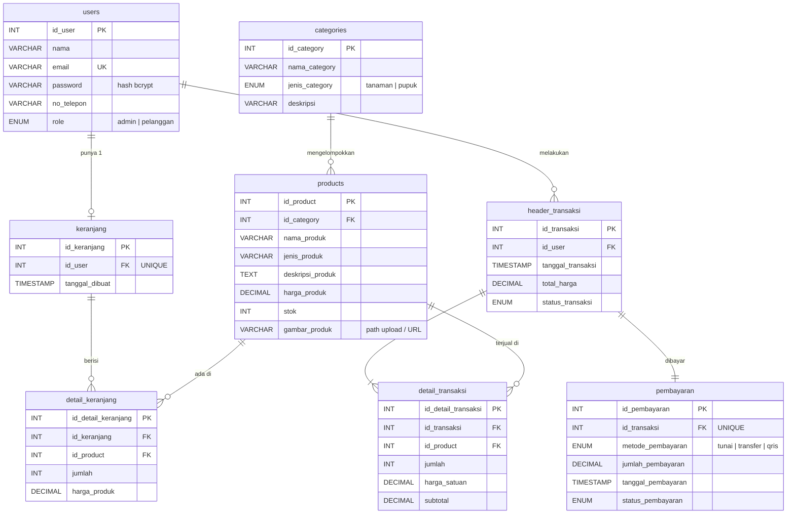

# ERD Rimbun (database `defaultdb`)

```mermaid
erDiagram
    users ||--o| keranjang : "punya 1"
    keranjang ||--o{ detail_keranjang : berisi
    products ||--o{ detail_keranjang : "ada di"
    categories ||--o{ products : mengelompokkan
    users ||--o{ header_transaksi : melakukan
    header_transaksi ||--|{ detail_transaksi : berisi
    products ||--o{ detail_transaksi : "terjual di"
    header_transaksi ||--|| pembayaran : dibayar

    users {
        INT id_user PK
        VARCHAR nama
        VARCHAR email UK
        VARCHAR password "hash bcrypt"
        VARCHAR no_telepon
        ENUM role "admin | pelanggan"
    }
    categories {
        INT id_category PK
        VARCHAR nama_category
        ENUM jenis_category "tanaman | pupuk"
        VARCHAR deskripsi
    }
    products {
        INT id_product PK
        INT id_category FK
        VARCHAR nama_produk
        VARCHAR jenis_produk
        TEXT deskripsi_produk
        DECIMAL harga_produk
        INT stok
        VARCHAR gambar_produk "path upload / URL"
    }
    keranjang {
        INT id_keranjang PK
        INT id_user FK "UNIQUE"
        TIMESTAMP tanggal_dibuat
    }
    detail_keranjang {
        INT id_detail_keranjang PK
        INT id_keranjang FK
        INT id_product FK
        INT jumlah
        DECIMAL harga_produk
    }
    header_transaksi {
        INT id_transaksi PK
        INT id_user FK
        TIMESTAMP tanggal_transaksi
        DECIMAL total_harga
        ENUM status_transaksi
    }
    detail_transaksi {
        INT id_detail_transaksi PK
        INT id_transaksi FK
        INT id_product FK
        INT jumlah
        DECIMAL harga_satuan
        DECIMAL subtotal
    }
    pembayaran {
        INT id_pembayaran PK
        INT id_transaksi FK "UNIQUE"
        ENUM metode_pembayaran "tunai | transfer | qris"
        DECIMAL jumlah_pembayaran
        TIMESTAMP tanggal_pembayaran
        ENUM status_pembayaran
    }
```
